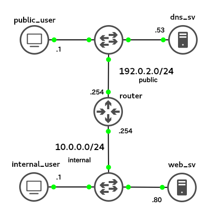

## 問題

### トポロジ



今まで`public`側で運用していたwebサーバをNAT環境の`internal`に移行したところ、`public`側からはwebページを見ることができるが、`internal`側からは見れなくなってしまった。

`router`を操作して`internal`側からもwebサーバを閲覧できるようにしてください。また、`internal`側に新たにホストを追加した際もwebサーバを見れるようにすること。


## 目標
web_svで運用している`http://hoge.aso-ecc`への`GETリクエスト`が成功し、以下の出力を得ることができること。

```
vagrant@pubuser:~$ curl http://hoge.aso-ecc
     _
   _| |
 _| | |
| | | |
| | | | __
| | | |/  |       /\ \  OK!!!
|      /  \/
|      \  /|       \/ /
 \        /
  |     /
  |    |
```

```
vagrant@internaluser:~$ curl http://hoge.aso-ecc
     _
   _| |
 _| | |
| | | |
| | | | __
| | | |/  |       /\ \  OK!!!
|      /  \/
|      \  /|       \/ /
 \        /
  |     /
  |    |
```
