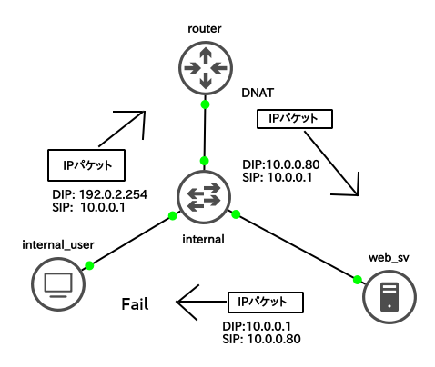

## 解説

この問題は、[ICTSC2018 本戦 問題解説: コンテナなのに環境を変えたら動かなくなった！？](https://blog.icttoracon.net/2019/03/21/ictsc2018-f-22/)を参考にしたもの.

NAT環境下にある`web_sv`に対して`public`側からアクセスするために`router`はDNATを行うことで`public`側からのアクセスを確保しているが、以下の図のように`internal`側の`internal_user`から`http://hoge.aso-ecc`にアクセスした場合、帰りの宛先IPアドレスが異なるため通信が失敗する.



```
vagrant@internaluser:~$ curl http://hoge.aso-ecc
curl: (7) Failed to connect to hoge.aso-ecc port 80: Connection timed out
```


想定した解法は2つ.


### 1つ目

routerに内向きのDNSサーバを立て、`hoge.aso-ecc`に対しての名前解決で`10.0.0.80`を返すようにして、`router`内部で動いているDHCPサーバにDNSサーバの参照先を`router`自身に変更する.

### 2つ目

ヘアピンNATを使用したもの.この問題を解決するには`internal_user`と`web_sv`間の全てのトラフィックが`router`を通過することで解決することができる.つまり、`router`でDNATした後のパケットを`router`の`internal`側のIFでNAPTすればいい.

以下に例を示す.
```
root@router:~# iptables -t nat -I POSTROUTING 1 -o enp0s9 -p tcp --dst 10.0.0.80 --dport 80 -s 10.0.0.0/24 -j MASQUERADE
```

このようにすることで`internal_user`と`web_sv`間のパケットが以下のようになる.

- `internal_user`->`router`
	- DIP: 192.0.2.254
	- SIP: 10.0.0.1

- `router`にてDNATとNAPT
	- DIP: 10.0.0.80
	- SIP: 10.0.0.254

- `router`->`web_sv`
	- DIP: 10.0.0.80
	- SIP: 10.0.0.254

- `web_sv`->`router`
	- DIP: 10.0.0.254
	- SIP: 10.0.0.80

- `router`にてDNATとNAPTが取り消される.
	- DIP: 10.0.0.1
	- SIP: 192.0.2.254

- `router`->`internal_user`
	- DIP: 10.0.0.1
	- SIP: 192.0.2.254


設定後

```
vagrant@internaluser:~$ curl http://hoge.aso-ecc
     _
   _| |
 _| | |
| | | |
| | | | __
| | | |/  |       /\ \  OK!!!
|      /  \/
|      \  /|       \/ /
 \        /
  |     /
  |    |


```
